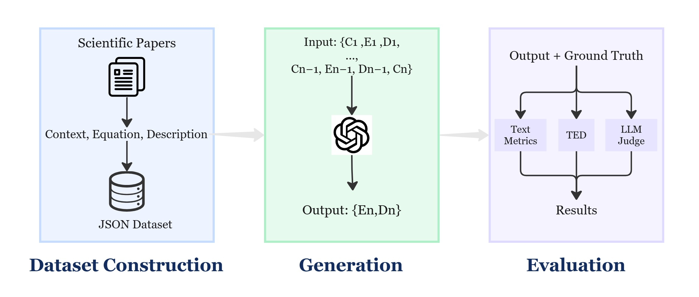

# Evaluating Mathematical Reasoning Capabilities of LLMs Within Scientific Literature
This repository contains the code and data supporting my master's thesis, which investigates the capabilities of large language models (LLMs) in generating mathematical equations from scientific text. 

## Overview
In this work, we introduce a novel framework that explores large language models (LLMs) for equation generation from scientific context. We leverage LLMs' mathematical reasoning abilities and scientific domain knowledge to infer missing equations directly from surrounding text in scientific literature. The framework casts equation generation as a contextual translation task and incorporates prompt engineering to guide model behavior. To evaluate output quality, we propose  an evaluation framework that combines standard text similarity metrics, structure-aware measures, and an LLM-as-a-Judge methodology. Experiments across multiple LLMs and metrics show that current models can generate syntactically plausible equations but often fall short on deep semantic alignment. Our analysis highlights the limitations of existing automatic metrics and introduces LLM-based judgment as a promising complementary approach for evaluating math reasoning tasks.



## Get Started
```
# Clone the repository
git clone https://github.com/imxiaoxiaohh/master_thesis_project.git

cd math-equation-generation

# Install dependencies
pip install -r requirements.txt

```

## Dataset

- **Location**: [Dataset/academic_dataset_Final.json](Dataset/academic_dataset_Final.json)
- **Format**: List of papers, each with:
  - `id`, `title`
  - `equations`: list of objects with
    - `equation id`
    - `context` (surrounding text)
    - `description` (variable/explanation, optional)
    - `EQ_latex` (list of LaTeX strings)

## Generation Pipeline

### 1. Equation Generation

- **Script**: [`Generation/main.py`](Generation/main.py)
```bash
python Generation/main.py --llm <llm_name> [--fresh] [--papers <paper_id1> <paper_id2> ...] [--status] [--list]
```
- **Usage**:
  - `--llm`: LLM to use (see below for options)

  - `--fresh`: Ignore previous results and start anew

  - `--papers`: Only generate for specific paper IDs

  - `--status`: Show current progress

  - `--list`: List available LLMs

- **Supported LLMs**:
  - OpenAI: `gpt-o1-mini`, `gpt-4o-mini`, `gpt-4.1-mini`, `gpt-4.1` 
  - Deepseek: `deepseek-R1`
  - Together AI: `llama3.3-70B`, `qwen3-235B`, `qwen-qwq-32B`

### 2. Output
- **Output Format**: Each generated result is wrapped as:
```
  <latex> ... </latex>
  <description> ... </description>
```
- **Output Location**: Results are saved in `Generation/outputs/<llm_name>_results.json`.

## Evaluation Pipeline

### 1. Table Generation

- **Script**: [`Evaluation/generate_evaluation_table.py`](Evaluation/generate_evaluation_table.py)
- **Purpose**: Converts generation outputs and ground truth into a CSV for evaluation.
- **Output**: CSV files in `Evaluation/data/raw_csv/`

---

### 2. Automatic Metrics

- **Script**: [`Evaluation/metrics_evaluation.py`](Evaluation/metrics_evaluation.py)

- **Metrics**: TeXBLEU, Levenshtein distance, sequence similarity, ROUGE-L, tree edit distance, etc.

- **Output**: Metrics CSV in `Evaluation/data/result_csv/`

### 3. LLM-as-Judge Evaluation
- **Script**: [`Evaluation/llm_as_judge.py`](Evaluation/llm_as_judge.py)
- **Usage**:
- **Dimensions**: Semantic accuracy, reasoning quality, informational completeness, syntactic correctness, contextual appropriateness (all scored 1–5).
- **Output**: LLM-judged results in `Evaluation/data/result_csv/`


## How to Run

### 0. Set API Keys

Before running anything, set the required API keys as environment variables.

#### On Windows (PowerShell):
```powershell
$env:OPENAI_API_KEY="your-openai-key"
$env:ANTHROPIC_API_KEY="your-anthropic-key"
$env:DeepSeek_API_Key="your-deepseek-key"
$env:TOGETHER_API_KEY="your-together-key"
$env:HF_API_KEY="your-huggingface-key"
```
### 1. Generate equations:
```
python Generation/main.py --llm gpt-4.1
```
### 2. Convert outputs to evaluation table:
```
python Evaluation/generate_evaluation_table.py
```
### 3. Run automatic metrics:
```
python Evaluation/metrics_evaluation.py --input_csv <your_csv>
```
### 4. Run LLM-based evaluation:
```
python Evaluation/llm_as_judge.py --input_csv <your_csv>
```
